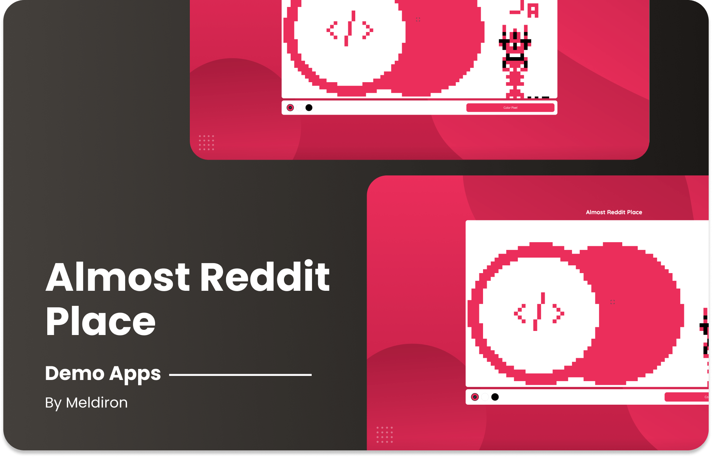

# Almost Reddit Place

> README file will be written once the project is finished.



Almost Reddit Place is r/place canvas clone made with Appwrite, Alpine.js and TailwindCSS. I decided to create this project to showcase what Appwrite is capable of, and learn how to work with canvas on website.

## 🧰 Appwrite Setup

Before using this application, make sure you have Appwrite server up and running. You can follow [Appwrite installation guide](https://appwrite.io/docs/installation).

1. Install [Appwrite CLI](https://appwrite.io/docs/command-line)
2. Login with `appwrite login`
3. Visit your Appwrite Console and create project with ID `almostRedditPlaceV2`
4. Run initial setup with `appwrite deploy --all`

That's it 🥳 Your canvas will be empty. If you want to fill upper left corner of your canvas with Appwrite logo, you can run seeding script:

1. Enter folder `cd appwrite`
2. Copy env file `cp .env.example .env`
3. Update env file `nano .env` (fill information about your Appwrite project)
4. Install dependencies `npm install`
5. Run seeding script `node seed.js`

Seeding script can take up to a few minutes to finish, please be patient. Once finished, Appwrite logo will be added onto you canvas.

## 🤖 Running Website

Website uses [TailwindCSS](https://tailwindcss.com/) and [Alpine.js](https://alpinejs.dev/), meaning it is pure HTML, CSS and JS code. To run website, you can upload file from this folder onto any HTTP server. For local development, you can run:

```sh
npx -y http-server
```

This will spinup HTTP server you can visit at [http://localhost:8080/](http://localhost:8080/).

## 🚀 Deploying

To deploy a website, simply drag&drop all files into folder of FTP server provided by your website hosting provider. If you use [Vercel](https://vercel.com/meldiron) or [Netlify](https://www.netlify.com/), you can use following setup:

- Override all of the commands
- Install command: `` (empty)
- Build command: `` (empty)
- Output directory: `.`
- Development command: `` (empty)

## 🧑‍🎓 Development Notes

- You might notice files `_png-to-pixels.html`. You can ignore or remove this file, it is used to convert PNG to pixels array. This generates proper format of pixels for seeding script to be capable of inserting any PNG into canvas.
- If you want to print anything else than Appwrite logo onto canvas, you can edit `appwrite/pixels.json` file with pixels array. You can either write it on your own, or use generator in `_png-to-pisels.html`
- For authentication modal, website is using [Auth Modal](https://github.com/TringuG/auth-modal) library. CDN version of this library didn't work properly, that's the only reason why we use local copy.